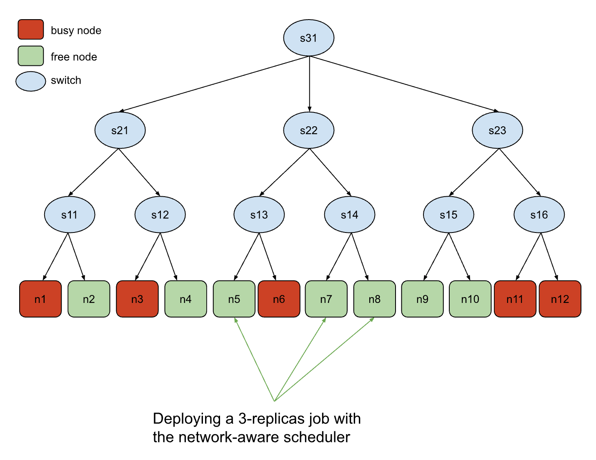

# Benchmark Tests

This directory contains benchmark tests for the following workload managers and schedulers:

- Kueue
- Volcano
- Yunikorn
- Run:ai

The benchmark tests involve submitting workloads intended to evaluate the scheduler's performance under specific scenarios.

These workloads are designed to fully utilize the cluster under optimal scheduling conditions.

One approach to benchmarking is to run this workload on clusters with different schedulers and then compare the average GPU occupancy of the nodes.

For all workload managers except Run:ai, the benchmark test involves two sequential workflows. The first workflow registers the CRDs, and the second workflow runs the common part of the test.
Run:ai requires additional customization and thus has a separate workflow

## Gang Scheduling Benchmark Test

The gang-scheduling benchmark workflow operates on 32 virtual GPU nodes, submitting a burst of 53 jobs with replica numbers ranging from 1 to 32 in a [predetermined order](gang-scheduling/workflows/run-test.yaml).

#### Example

To run the benchmark test for Kueue:

```bash
./scripts/benchmarks/gang-scheduling/run-kueue.sh
```

To run the benchmark test for Run:ai

```bash
./scripts/benchmarks/gang-scheduling/run-runai.sh
```

## Scaling Benchmark Test

The scaling benchmark workflow operates on 500 virtual GPU nodes with tho workflows. The first [workflow](scaling/workflows/run-test-multi.yaml) submits is a job with 500 replicas, the second [workflow](scaling/workflows/run-test-single.yaml) submits a batch of 500 single-node jobs.

### Example

To run the benchmark test for Volcano:

```bash
./bin/knavigator -workflow 'resources/benchmarks/scaling/workflows/{config-nodes.yaml,config-volcano.yaml,run-test-multi.yaml}'
```

To run the benchmark test for Run:ai

```bash
./bin/knavigator -workflow 'resources/benchmarks/scaling/workflows/{config-nodes.yaml,config-runai.yaml,runai-test-single.yaml}'
```

## Network Topology Benchmark Test

The network topology benchmark workflow runs on 12 virtual GPU nodes, arranged to simulate a tree-like network topology.
Out of these, 5 nodes are marked as busy, leaving 7 nodes available. The workflow submits a job with 3 replicas.

From a network connectivity standpoint, the optimal assignment would be nodes n5, n7, and n8, as shown in the following diagram.



### Example

To run the benchmark test for Run:ai

```bash
./bin/knavigator -workflow 'resources/benchmarks/nwtopo/workflows/{config-nodes.yaml,runai-test.yaml}'
```
